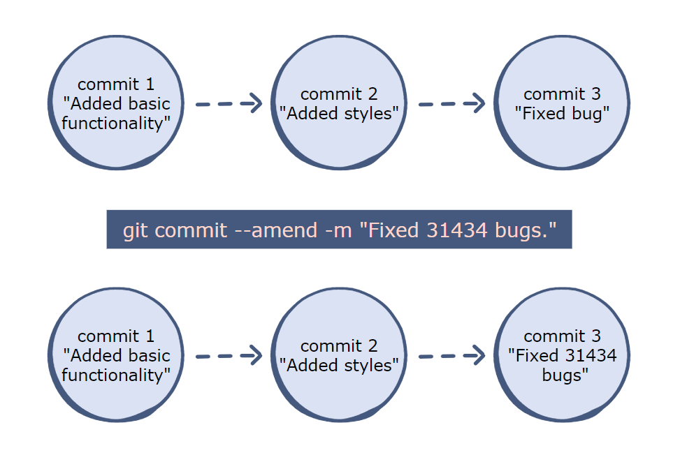

## What is a .gitignore file?

The `.gitignore` file is just a simple text file where we can add files that we want git to ignore. Simply put, they won't be tracked by git.

```
node_modules
*.pyc
```

---

## > Useful cmd/shell commands

### cmd

- `rmdir /S <nonEmpty_directory>` : deletes the non-empty directory recursively, prompts
- `fsutil file createnew <fileName> 0` : creates a zero byte file, similar to `touch` but needs administrator privilege
- `echo >> <fileName>` : creates a file with content `ECHO is on.` irrespective of file extension.

### shell

- `rm -rf <nonEmpty_directory>` : deletes the non-empty directory recursively without prompting anything.

---

## > Git quick lookup commands

- `git init` : creates a hidden folder, .git, needed for Git to work.
- `git status` : review the list of files
- `git add <fileName1> <fileName2> <...>` : stage individual files
- `git add .` : track and add all files to staging
- `git commit -m '<topic> -m '<description>'` : commit files staged with a message
- `git checkout -b <branchName>` : create a branch and switch to it
- `git remote add origin <remoteURL>`: link your local git with remote github repo
- `git push -u origin master` : push your branch to remote ( -u as a shorthand for --set-upstream)
- `git checkout -b <name> <otherBranch/masterBranch> ` : make a branch of otherBranch/masterBranch
- `git push origin -d <branchName>` : delete your remote branch
- `git branch -d/D <branchName>` : delete your local branch
- `git log --oneline` : will show all of your commits with only the first part of the hash and the commit message
- `git pull` : pull from remote repo, if upstream is set
- `git pull origin <branchName>` : pull from remote repo specific branch and if upstream is not set
- `git reset` : unstage the staged files
- `git reset <fileName>` : unstage a specific file
- `git reset HEAD~1` : unstage and uncommit the last commit, soft reset
- `git reset --HARD <hash>/<HEAD~n>` : hard reset commit

---

## > Quick Links

| [Staging](#-staging) | [Remote](#-remote) | [Pushing](#-pushing) | [Undoing](#-undoing) | [Renaming](#-renaming) | [Branching](#-branching) | [Stashing](#-stashing) | [Tags](#git-tags) | [Merging](#-merging) |
| -------------------- | ------------------ | -------------------- | -------------------- | ---------------------- | ------------------------ | ---------------------- | ----------------- | -------------------- |

## > FAQ

- [How to change commit message?](#how-to-change-commit-message)
- [How to merge an orphan branch into master?](#how-to-merge-an-orphan-branch-into-master)
- [How to move your work in progress to another branch?](#how-to-move-your-work-in-progress-to-another-branch)
- [How to move commit from one branch to another (cherry-pick)?](#cherry-pick)
- [How to handle merge conflict?](#merge-conflict)
- [How to create an empty commit?](#creating-an-empty-commit)
- [Restore repository to the new state (unstage first commit)](#restore-repository-to-a-new-state)
- [What is Semantic Versioning?](#introduction-to-semantic-versioning)
- [Git Workflow](#git-feature-branch-workflow-management)

---

## > Setting username and email

That will allow commits to have the right author name and email associated to them and has nothing to do with authentication when pushing to a remote repository.

- To declare that identity for all repositories, use `git config --global`

```
git config --global user.name "Your Name"
git config --global user.email mail@example.com
```

- To declare an identity for a single repository, use `git config` inside a repo

```
cd/path/to/my/repo
git config user.name "Your Login At Work"
git config user.email mail_at_work@example.com
```

---

## > Log, shortlog and show

- `git log` : will display all your commits with the author and hash
- `git log -2` : list last 2 commit logs
- `git log --oneline` : will show all of your commits with only the first part of the hash and the commit message
- `git log -2 --oneline` : last 2 commit logs oneline
- `git shortlog` : list of all commits made per committe
- `git show <hash>` : view contents of a single commit

### Show the total number of commits per author

- `git shortlog -s` : provides the author names and number of commits by each one
- `git shortlog -s--all` : provides the author names and number of commits by each one on all branches
- `git shortlog -sn` : Names and Number of commits
- `git shortlog -sne` : Names along with their email ids and the Number of commits

### Show stats

`git log --stats` : shows added/deleted stats of commit

Click on the [:arrow_up:](#-quick-links) arrow to move to the top

---

## > Remote

- `git remote` : shows the short name of each remote handle
- `git remote -v` : detailed information includes the URL and type of remote(push or pull)
- `git remote set-url <origin/alias> https://github.com/username/repo.git`: change 'origin' remote's URL/ set URL for a specific remote
- `git remote get-url <name>` : url for an existing remote
- `git remote show origin` : lists the URL for the remote repository as well as the tracking branch information
- `git remote prune origin --dry-run` : lists branches that can be deleted/pruned on your local
- `git remote prune origin` : prune/cleanup the local references

### Remove a Remote Repository

- `git remote rm <name>` : remove a remote repository

### Rename a Remote Repository // Didn't worked!

- `git remote rename <old> <new>` : change the alias/shortname, for example; origin to destination

### Show more information about remote Repository

- `git remote show origin`

### Add a Remote Repository

- `git remote add <shortname> <url>`
  The command git fetch<name> can then be used to create and update remote-tracking branches<name>/<branch>

Click on the [:arrow_up:](#-quick-links) arrow to move to the top

---

## > Staging

- `git add --all/-A` : stage all modified, deleted, new and dot files in the entire working tree
- `git add -A <directory>/` : stage all thats within that directory
- `git add -u` : stage all modified and deleted files not untracked/new files in the entire working tree
- `git add -u <directory>/` : stage only modified and deleted files within that directory
- `git add *` : not recommended as it ignores dot files, deleted files and top level files of the working tree
- `git add .` : will stage all changes to files in the current directory
- `git reset <filePath>` : unstage a file that contains changes
- `git diff` : displays what will be committed
- `git diff <hash1> <hash2>` : difference between in code of 2 hashes
- `git rm --cached <filename>` : delete the file from git without removing it from disk

Click on the [:arrow_up:](#-quick-links) arrow to move to the top

---

## > Undoing

To jump back to a previous commit, first find the commit's hash using `git log`.

- `git reset --soft <hash>` : To roll back to a previous commit [hash] while keeping the changes in staged area, no work is lost
- `git reset --soft HEAD~<n>` : roll back to last commit, here [n] is the value for unwinding the last n commits
- `git reset <hash>` : similar to soft reset except files are put in working area or unstaged area
- `git reset --hard <hash>` : to permanently discard any changes made after a specific commit, reverts tracked files back to the state they were and leaves untracked files alone
- `git clean -df` : removes any untracked [d] directory [f] files
- `git reset --hard HEAD~<n>` : permanetly discard any changes made after the last commit, here [n] is the value for unwinding the last n commits

While you can recover the discarded commits using `reflog` and `reset`, uncommitted changes cannot be recovered. Use `git stash`; `git reset` instead of `git reset --hard` to be safe.

### Restore repository to a new state

- Delete the HEAD and restore your repository to a new state, where you can create a new initial commit:
  `git update-ref -d HEAD`

- After you create a new commit, if you have already pushed to remote, you will need to force it to the remote in order to overwrite the previous initial commit:
  `git push --force origin`

### Using reflog

- `git reflog`: if you screw up a rebase, one option to start again is to go back to the commit (pre rebase). You can do this using reflog (which has the history of everything you've done for the last 90 days - this can be configured)

- `git checkout HEAD@{3}` : to create a new branch. Now you could delete the screwed up branch OR
- `git reset --hard HEAD@{3}` : reset directly back to a point in your `reflog`. There is no turning back so be 100% sure.

Click on the [:arrow_up:](#-quick-links) arrow to move to the top

---

## > Merging

- `git merge <another_branch>` : make sure you are in the branch that is getting merged into, retains all the commits of merged branch.
- `git merge --squash <another_branch>` : summarizes all the different commits into the last commit, then merges this last commit with the latest of active branch.
- `git merge --abort` : after starting a merge, you might want to stop the merge and return everything to its pre-merge state
- `git merge <branch_name> --no-ff -m "<commit message>"` : merge with a commit as default behaviour in fast-forward only updates the branch pointer without creating a merge commit.

### Merge conflict

In case of a merge conflict,

```bash
<<<<<<< HEAD
=======
>>>>>>> <branchName>
```

- Clear these characters and proceed with `git commit`, no need for message, as this a merge-commit.
- Something else will pop-up, just do `Shift + ;` and do `:wq` i,e; write & quit.

Click on the [:arrow_up:](#-quick-links) arrow to move to the top

---

## > Committing

Commits with Git provide accountability by attributing authors with changes to code.

### Amending a commit

- `git commit --amend` : this will put the currently staged changes onto the previous commit

Note: This can also be used to edit an incorrect commit message. It will bring up the default editor and allow one to change the prior message.

### How to change commit message

- `git commit --amend -m "New message"` : specify the commit message



Note: Be aware that amending the most recent commit replaces it entirely, hash is changed as commit message is part of the hash and the previous commit is removed from the branch's history. This should be kept in mind when working with public repositories and on branches with other collaborators.

This means that if the earlier commit had already been pushed, after amending it you will have to `git push --force`.

### Commit message

- `git commit -m "Commit summary" -m "More detailed description follows here"` : can pass in multiple -m arguments

### Add and commit

- `git commit -am <message>` : adds changes made to tracked (modified) files and commits them.

### Creating an empty commit

- `git commit -m "This is a blank commit" --allow-empty` : able to easily create commits without having to edit/touch a dummy file.

The `--allow-empty` commit will bypass the check.

### Committing on behalf of someone else

- `git commit -m "msg" --author "John Smith <johnsmith@example.com>"` : can give them credit with the --author option.

### Cherry-pick

- `git log` to get the hash of the commit you would like to cherry-pick and copy first 6-7 characters.
- `git checkout <branchName>` move to the barnch where you would like to copy/bring over that commit.
- `git cherry-pick <hash>` will bring the changes to the branch and will commit it.

### Cherry-pick without commit

- `git cherry-pick <hash> -n` will bring the changes to the branch and will put the code in staged area. `-n` means no commit.

Click on the [:arrow_up:](#-quick-links) arrow to move to the top

---

## > Cloning Repositories

The git clone command is used to copy an existing Git repository from a server to the local machine

- `git clone https://github.com/username/projectname.git`: clones the repo in your current directory.
- `git clone https://github.com/username/projectname.git MyFolder` : clones the repo into MyFolder in your current directory.

### Shallow Clone

- `git clone [repo_url] --depth 1` : will fetch just the last commit from the remote repository

### Clone a specific branch

- `git clone --branch/-b <branch name> <url> [directory]`

Click on the [:arrow_up:](#-quick-links) arrow to move to the top

---

## > Aliases

- `git config --global alias.<shortcut> '<command>'`: example `alias.st status` for `git status`

## > Rebasing TO_DO

---

## > Branching

- `git branch -a` : list all branch
- `git branch <name>` : create a new branch while staying on the current branch
- `git checkout <name>` : switch to an existing branch
- `git checkout -b <name>` : create a new branch and switch to it
- `git checkout -b <name> <otherBranch/masterBranch> ` : make a branch of otherBranch/masterBranch
- `git branch <name> [<start-point>]` : start-point -> can be another branch name, commit SHA, HEAD or a tag name
  Example:

```
git checkout -b <name> some_other_branch
git checkout -b <name> af295
git checkout -b <name> HEAD~2 // Go back 2 commits, you will lose uncommitted work
git checkout -b <name> v1.0.5
```

- `git checkout -` : quick switch to previous branch

### Delete a remote branch

- `git push origin :<branchName>` : delete a branch on the origin remote repository
- `git push origin -d <branchName>`

### Delete a local branch

- `git branch -d <branchName>` : is not able to delete if it has unmerged changes
- `git branch -D <branchName>` : deletes even if it has unmerged changes

### Orphan branch

- `git checkout --orphan new-orphan-branch` : branch with no parent commit

### How to merge an orphan branch into master

- After a git pull or git merge command, add the following tag:
  `git pull origin master --allow-unrelated-histories`

Click on the [:arrow_up:](#-quick-links) arrow to move to the top

---

## > Stashing

Code not ready to commit but needs to be saved to be applied later. That's where git `git stash` comes in. Stashing does not remember the branch from where the work has been stashed so checking out to a new branch and applying those stashed changes using `git stash apply` is possible.

- `git stash` : stashes all tracked files.
- `git stash --include-untracked/-u` : include all untracked files

- `git stash save "message"` : message with your stash to make it identifiable
- `git stash -keep-index/-k` : leave the staging area in current state after stash

### List saved stashes

- `git stash list` : all stashes in the stack in reverse chronological order

### Show Stash

- `git stash show` : show the changes saved in the last stash
- `git stash show stash@{n}` : specific stash
- `git stash show -p stash@{n}` : content of the specific stash

### Apply stash

- `git stash apply` : apply last stash without removing it
- `git stash apply stash@{n}` : apply a specific stash

### Apply and remove stash from stash list

- `git stash pop` : apply last stash and remove it from the stack
- `git stash pop stash@{n}` : apply a specific stash and remove it from the stack

- To remove all stash `git stash clear`
- Remove the last stash `git stash drop`
- `git stash drop stash@{n}` : remove a specific stash

### How to move your work in progress to another branch

```bash
git stash
git checkout correct-branch
git stash pop
```

Click on the [:arrow_up:](#-quick-links) arrow to move to the top

---

## > Renaming

- `git branch -m old_name new_name` : renaming a local branch

### Renaming a local and the remote branch:

- Checkout from the branch
  then rename the local branch, delete the old remote and set the new renamed branch as upstream:

```
git checkout old_branch
git branch -m new_branch
git push origin :old_branch // git push origin -d old_branch
git push--set-upstream origin new_branch
```

---

## > Pushing

- `git push <remotename> <object>:<remotebranchname>` : general syntax

### Delete remote branch

- `git push <remotename> :<remotebranchname>` : Deleting the remote branch is the equivalent of pushing an empty object to it.
  Example: `git push origin :wip-yourname`: will delete the remote branch wip-yourname
  Instead of using the colon, you can also use the `--delete` flag, which is better readable in some cases.
  Example: `git push origin --delete wip-yourname`

- `git push origin feature_x` : to push to a specific branch, for example: feature_x

### Set the remote tracking branch

- `git push --set-upstream origin master` OR
- `git push -u origin master` ( -u as a shorthand for --set-upstream)

> The `-u` flag adds it as a remote tracking branch. After setting up the tracking branch, `git push` can be invoked without any parameters to automatically push the branch to the central repository.

### Pushing to a new repository

To push to a repository that you haven't made yet, or is empty:

- Create the repository on GitHub (if applicable).
- Copy the url given to you, in the form `https://github.com/USERNAME/REPO_NAME.git`.
- Go to your local repository, and execute `git remote add origin URL`.
- To verify it was added, run `git remote -v` Run git push origin master.
  Your code should now be on GitHub

### Force pushing

- `git push -f`: will overwrite any remote changes and your remote will match your local
  Using this command may cause the remote repository to lose commits. Moreover, it is strongly advised
  against doing a force push if you are sharing this remote repository with others, since their history will retain every
  overwritten commit, thus rending their work out of sync with the remote repository.

Click on the [:arrow_up:](#-quick-links) arrow to move to the top

---

## > Blaming

### Only show certain lines

- `git blame -L <start>,<end>` : Example `git blame -L 10,30`
- `git blame -L /regex/` : Example `git blame -L /void main/` and `git blame -L 46, /void foo/`

### To find out who changed a file

- `git blame <filename>` : shows the author and commit per line of specified file
- `git blame -L 1,10 test.c` : limits the selection of lines by specified range

### Archive

- `git archive --format zip HEAD > archive-HEAD.zip` : creates a zip archive of current HEAD revision
  Alternatively it is possible to just specify an output file with valid extension and the format and compression typewill be inferred from it
- `git archive --output=archive-HEAD.tar.gz HEAD`
- `git archive --output=archive-HEAD.zip --prefix=src-directory-name HEAD` : When extracted all the files will be extracted inside a directory named src-directory-name in the current directory.

Click on the [:arrow_up:](#-quick-links) arrow to move to the top

---

## > Git useful notes:

git does not recognice the concept of folders, it just works with files and their filepaths. This means git does not track empty folders.
If you want to keep an directory that your application rely on for example 'build', a convention is to include a '.gitkeep' file inside the directory and let Git track that file.

```
git add build/.gitkeep
git commit -m 'Keep the build directory around'
```

### Good commit messages

The seven rules of a great git commit message

1. Separate the subject line from body with a blank line.
2. Limit the subject line to 50 characters.
3. Capitalize the subject line.
4. Do not end the subject line with a period.
5. Use the imperative mood in the subject line.
6. Manually wrap each line of the body at 72 characters.
7. Use the body to explain what and why instead of how.

Examples:

```
TASK-123: Implement login through OAuth
TASK-124: Add auto minification of JS/CSS files
TASK-125: Fix minifier error when name > 200 chars
```

- [Git: Styleguide](https://udacity.github.io/git-styleguide/)<br>
- [Git: Guide to commit message by Chris Beams](https://chris.beams.io/posts/git-commit/)

Click on the [:arrow_up:](#-quick-links) arrow to move to the top

---

## Introduction to Semantic Versioning

Also referred to as **SemVer** is versioning system that helps everyone involved i.e; from software developers, release managers to end consumers in software development to keep track of what is going on.

- It is a 3-component number, X.Y.Z: where

  - X: Major Version: Breaks API
  - Y: Minor Version: New features in backward-compatible way, does not break the API
  - Z: Patch : Bug fixes

- Pre-release: Appending a hyphen to the end of the SemVer sequence. Example: Version 1.0.0 could be 1.0.0-alpha.1.

### Advantages of SemVer :

- You can keep track of every transition in the software development phase.
- Versioning can do the job of explaining the developers about what type of changes have taken place and the possible updates that should take place in the software.
- It helps to keep things clean and meaningful.
- It helps other people who might be using your project as a dependency.

### Points to keep in mind :

- The first version starts at 0.1.0 and not at 0.0.1, as no bug fixes have taken place, rather we start off with a set of features as first draft of the project.
- Before 1.0.0 is only the Development Phase, where you focus on getting stuff done.
- SemVer does not cover libraries tagged 0._._. The first stable version is 1.0.0.

Click on the [:arrow_up:](#-quick-links) arrow to move to the top

---

## Git Feature Branch Workflow Management

- Make a branch from a master branch, `git checkout -b feature-#1 master`
- Keep commiting changes `git commit -m <message>`
- Add remote tracking, `git push -u origin feature-#1`
- Keep pushing changes to the feature branch, `git push`
- After everything has been pushed to the feature branch, checkout to master.
- Pull any update that has been made to the master meanwhile. `git pull`
- Now, do a pull merge, `git pull origin feature-#1`
- And push master to the remote with added changes of `feature-#1` branch, updating the remote master branch.

## Gitflow Workflow

Convention for branch name:

Feature branches? feature/
Release branches? release/0.1.0
Hotfix branches? hotfix/
Support branches? support/

The overall flow of Gitflow is:

- A `develop` branch is created from `master`
- A `release` branch is created from `develop`
- `Feature` branches are created from `develop`
- When a `feature` is complete it is merged into the `develop` branch
- When the `release` branch is done it is merged into `develop` and `master`
- If an issue in `master` is detected a `hotfix` branch is created from `master`
- Once the `hotfix` is complete it is merged to both `develop` and `master`

Click on the [:arrow_up:](#-quick-links) arrow to move to the top

---

## git-open

To install git-open: `npm install --global git-open`

### Commands

- `git open remote-name branch-name` : open the page for this branch on the repo website

- `git open --commit`
- `git open -c` : open the current commit in the repo website

- `git open --issue`
- `git open -i` : if this branch is named like issue/#123, this will open the corresponding issue in the repo website

- `git open --print`
- `git open -p` : only print the url at the terminal, but don't open it

Click on the [:arrow_up:](#-quick-links) arrow to move to the top

---

## Git TAGs

Tagging in Git or any other VCS refers to creating specific points in history for your repository/data. Usually done to mark release points. Example `stable`.

### Why create TAG?

- To mark release points for your code/data.
- To create historic restore points.

### When to create TAGs?

- When you want to create a release point for a stable version of your code.
- When you want to create a historic point for your code/data that you can refer at any future time(to restore your data)

### How to create a TAG?

- Checkout to the branch you would like to tag, `git checkout <branchName`
- Now add a tag, `git tag v1.0`, its a light-weight tag.
- To see whether tag has been applied to the branch or not, do `git tag` on the same branch.
- `git show v1.0` : details about the commit when it was tagged/ state of repository when it was tagged.
- `git tag -l "v1.*` : shows all tag with v1.\*.
- To create an annotated tag, `git tag -a v1.0 -m "<message>"`, will be stored as complete git object in git repository.

### How to push tags to remote?

- `git push origin <tagName>` : pushes the tag remote, release
- `git push --tags` : push all tags

### Delete tags from local

- `git tag -d <tagName>`/ `git tag --delete <tagName>`
- `git tag -d <tagName1> <tagName2>` : delete multiple tags from local repo

### Delete tags from remote

- `git push origin --delete/-d <tagName>`
- `git push origin :<tagName>`
- `git push origin -d <tagName1> <tagName2` : delete multiple tags from remote repository

### Create a branch from a tag and checkout to the branch

- `git checkout -b <branchName> <tagName>`

### Create a tag from some past commit

- `git tag <tagName> <hash>`

Click on the [:arrow_up:](#-quick-links) arrow to move to the top

---

## Other videos:

- [Tips & Tricks with GitHub](https://www.youtube.com/watch?v=sGnqVAfnZ6U)
